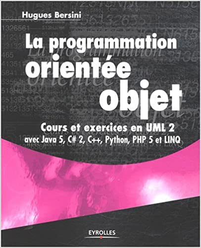

# Documentation fonctionnelle du projet CRM
*Authors : Anthony LEGRAND | Ewen BALOUIN | Thibault LEDANOIS | Manon JULIEN-KUENTZ*

## Table des matières
1. [Présentation](#présentation)  
    1. [Introduction](#introduction)
    2. [Glossaire](#glossaire)
        1. [Abréviations & Glossaire](#abréviations--glossaire)
        2. [Documents de références](#documents-de-références)
2. [Projet CRM : Workshops 2023](#projet-crm--workshops-2023)
    1. [Besoins fonctionnels](#besoins-fonctionnels)
        1. [Utilisateurs du projet CRM](#utilisateurs-du-projet-crm)
        2. [Fonctionnalités principales](#fonctionnalités-principales)
        3. [Navigation du site](#navigation-du-site)
    2. [Maquettes](#maquettes)
    3. [Utilisation du CRM](#utilisation-du-crm)
3. [Annexes](#annexes)
    1. [Sujet du projet](#sujet-du-projet)
    2. [présentation de la notation UML](#présentation-de-la-notation-uml)
    3. [Bibliographie technique](#bibliographie-technique)

 

---
## <ins> Présentation </ins>

### <ins> Introduction </ins>

Ce document technique décrit l'analyse orientée objet du projet CRM des Workshops 2023.  
Les annexes contiennent :  
- Le sujet du projet
- Une présentation résumée de la notation UML utilisée dans le document
- Une bibliographie technique sur UML

### <ins> Glossaire </ins>

Ce paragraphe fait état du glossaire afin que tous les termes utilisés dans le document soient compris de tous.

#### <ins> Abréviations & Glossaire </ins>

|Abréviation|Signification|
|---|---|
|UML|Unified Modeling Language|

#### <ins> Documents de références </ins>

|Identification|Description|
|---|---|
|[REF 1]|Sujet du projet (fourni en annexe)|

 
 
---
## <ins> Projet CRM : Workshops 2023 </ins>

### <ins> Besoins fonctionnels </ins>

Ce paragraphe va décrire les besoins fonctionnels du projet.

#### <ins> Utilisateurs du projet CRM </ins>

Le projet sera utilisé par deux types d'acteurs : l'employé et l'administrateur.
L'employé est un utilisateur lambda, connecté, n'ayant pas d'accès à la gestion de l'administration du site, contrairement à l'administrateur. Ces deux utilisateurs sont tous deux des employés de l'entreprise ayant mis en place le CRM dans son organisation.  

Un utilisateur lambda pourra : 
- Se connecter

Un employé connecté pourra : 
- Accéder à ses contacts (contacts B2C) et les gérer :
    - Créer un contact
    - Modifier un contact
    - Supprimer un contact
    - Importer un/des contacts depuis un fichier formet .csv
    - Exporter un/des contacts vers un fichier formet .csv
    - Utiliser les actions :
        - Créer une action
        - Modifier une action
- Accéder aux entreprises (contacts B2B) et les gérer : 
    - Créer une entreprise
    - Modifier une entreprise
    - Supprimer une entreprise

Un administrateur pourra : 
- Accéder à la liste des utilisateurs et les gérer :
    - Créer un utilisateur
    - Modifier un utilisateur
    - Supprimer un utilisateur

  

#### <ins> Fonctionnalités principales </ins>

Ce paragraphe détaille les fonctionnalités principales du site. 

#### <ins> Navigation du site </ins>

La navigation au sein du site est définie de manière à ce qu'un utilisateur soit obligé de se connecter pour accéder au reste des fonctionnalités. Une fois connecté, il est automatiquement redirigé vers le dashboard. Grâce au menu, il a constamment accès aux autres fonctionnalités.  
Si l'utilisateur est un administrateur, il a accès à l'administration.

### <ins> Maquettes </ins>

Voici ci-dessous l'ensemble des maquettes réalisées avec l'outil Figma par l'équipe. On y retrouve l'ensemble des pages nécessaires au bon fonctionnement de l'application. 

### <ins> Utilisation du CRM </ins>

Afin d'utiliser le projet CRM, n'oubliez pas dans un premier temps de suivre les instructions présentes dans le fichier [README](/README.md).

#### <ins> Créer un contact </ins>

Pour créer un contact, rendez-vous sur la page "Customers" puis cliquez sur le bouton "Create new Customer". Remplissez les champs et validez : votre nouveau contact est créé, et disponible dans la page associée au statut que vous avez défini.

#### <ins> Importer un contact </ins>

Pour importer un contact, rendez-vous sur la page "Import/Export". 
Choisissez le fichier au format csv de votre choix.  
**/!\ Attention  : le fichier doit obligatoirement contenir, dans l'ordre, les champs "first_name", "name", "email", "address".**  
Validez votre import : votre contact a été importé et est disponible dans la page "Customers".

#### <ins> Exporter les contacts </ins>

Pour exporter vos contacts, rendez-vous sur la page "Import/Export" et cliquez sur le bouton "Download all contacts". Les contacts ont tous été exportés au format csv.

#### <ins> Utilisation de la todo-list </ins>

 
 
---
## <ins> Annexes </ins>

### <ins> Sujet du projet </ins>

Cette documentation étant au format .md, il est impossible d'insérer correctement le brief fourni. Vous pourrez donc retrouver le sujet en [cliquant ici](/docs-assets/Brief_Workshop_CRM.pdf).

### <ins> Présentation de la notation UML </ins>

|Notion UML|Description|
|---|---|
||Acteur : rôle joué par un utilisateur humain ou auter système qui intéragit directement avec le système étudié. Un acteur participe à au moins un cas d'utilisation.|
||Cas d'utilisation (use case) : Ensemble de séquences d'actions réalisées par le système produisant un résultat observable intéressant pour un acteur particulier. Collection de scénarios reliés par un objectif utilisateur commun.|
||Périmètre du système : Il est habituel pour afficher des cas d'utilisation comme étant à l'intérieur du système et les acteurs comme étant en dehors du système.|
||Association : Utilisée dans ce type de diagramme pour relier les acteurs et les cas d'utilisation par une relation qui signifie simplement "participe à"|
||Extension : Le cas d'utilisation de base en incorpore implicitement un autre, de façon optionnelle, à un endroit spécifié indirectement dans celui qui procède à l'extension|
||Inclusion : Le cas d'utilisation de base incorpore explicitement un autre, de façon obligatoire, à un endroit spécifié dans ses enchaînements|

### <ins> Bibliographie technique </ins>

|Référence|Description|
|---|---|
||UML 2 par la pratique : Etudes de cas et exercices corrigés (Auteur : Pascal Roques)|
||La programmation orientée objet (Auteur : Hugues Bersini)|